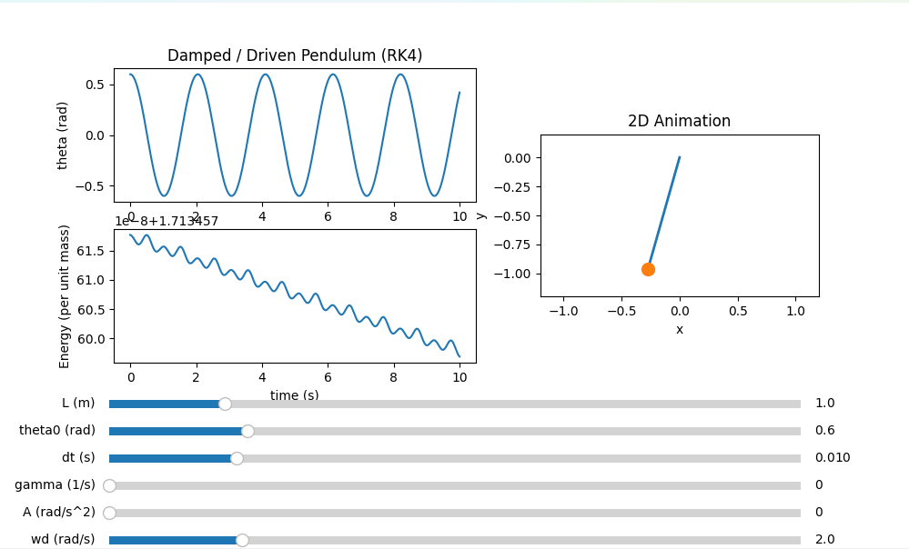

# Pendulum Project (Python)

->Example output showing the animated pendulum and accompanying time-series plots.


A small Python project to simulate and visualise pendulum motion using numerical methods and Matplotlib animation - to be upscaled in further models.  

## Features
- Pendulum dynamics simulation
- 2D animation using Matplotlib
- Modular structure (`src/`)

## Requirements
- Python >= 3.11

```md
## Setup
```bash
# Windows PowerShell:
python -m venv .venv
.\.venv\Scripts\Activate.ps1
pip install -r requirements.txt

# run
```bash
python main.py


```md
"Project Structure"
```md
## Project structure
main.py                      # entry point
src/core.py                  # model + numerical solver (RK4)
src/ui_matplotlib_anim2d.py  # animation UI
assets/                      # images / demo media (if present)


